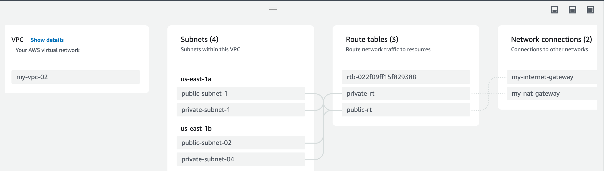

# VPC creation on aws

1. Create a VPC [IPv4 CIDR - 10.100.0.0/16]
2. Create 4 subnets
    - public-subnet-1 in AZ us-east-1a  [10.100.1.0/24]
    - private-subnet-1 in AZ us-east-1a [10.100.2.0/24]
    - public-subnet-2 in AZ us-east-1b. [10.100.3.0/24]
    - private-subnet-2 in AZ us-east-1a [10.100.4.0/24]
3. Create IGW
4. Attach VPC to IGW
5. Create NAT gateway in public subnet(us-east-1a - 10.100.1.0/24)
6. Create public route table 
    -   Edit routes > Allow all(0.0.0.0/0) traffic to pass through all IGW.
    -   Subnet Association > Edit Subnet associations > Add public subnets and save
7. Create private route table 
    -   Edit routes > Allow all(0.0.0.0/0) traffic to pass through all NAT gateway.
    -   Subnet Association > Edit Subnet associations > Add private subnets and save
8.  Goto VPC > resource map

Mappings should be like this : 

